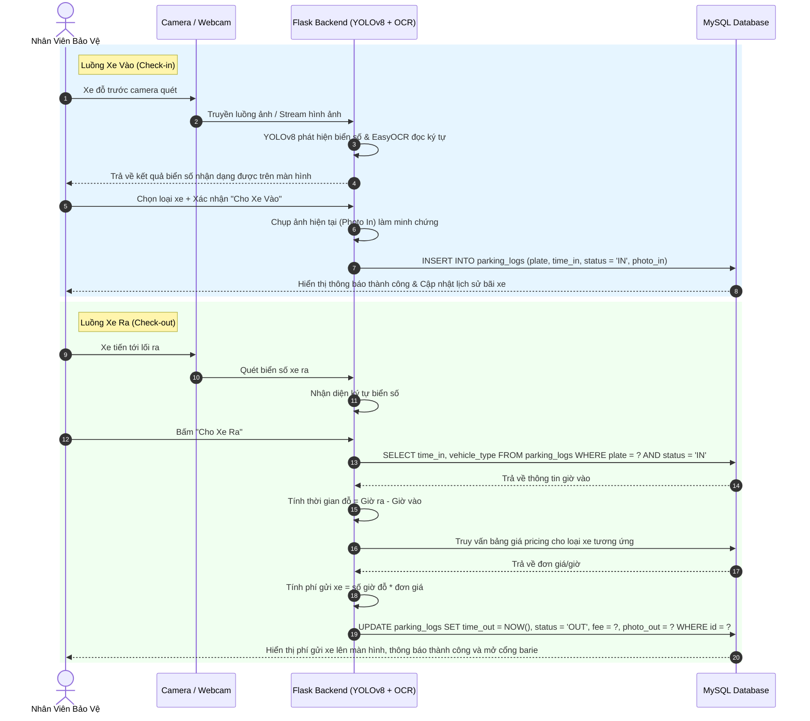

# 🅿️ Smart Parking System - Hệ Thống Quản Lý Bãi Xe Thông Minh

Hệ thống quản lý bãi giữ xe thông minh ứng dụng trí tuệ nhân tạo để tự động nhận diện biển số xe qua camera/hình ảnh/video, tự động tính toán phí gửi xe theo thời gian thực và quản lý nhân sự, doanh thu một cách hiệu quả.

---

## 🌟 Tính Năng Nổi Bật

1. **Nhận Diện Biển Số Tự Động (AI Detection & OCR):**
   * Sử dụng **YOLOv8** để phát hiện vị trí biển số xe (License Plate Detection) từ luồng Webcam trực tiếp, ảnh tải lên hoặc tệp Video.
   * Sử dụng **EasyOCR** để trích xuất ký tự chữ và số từ biển số đã phát hiện được với độ chính xác cao.
   * Hỗ trợ cơ chế **Xe bị che biển số / Biển số mờ**: Tự động tạo mã ID tạm thời để kiểm soát xe vào/ra.

2. **Quản Lý Xe Vào / Ra (Check-in / Check-out):**
   * **Xe vào:** Tự động chụp ảnh xe, nhận dạng biển số, ghi nhận thời gian vào, phân loại xe (Xe đạp, Xe máy, Ô tô) và lưu thông tin vào cơ sở dữ liệu.
   * **Xe ra:** Nhận diện lại biển số, đối chiếu cơ sở dữ liệu để kiểm tra trạng thái xe hợp lệ, tự động tính toán thời gian gửi xe (làm tròn theo giờ) và áp dụng bảng giá tương ứng để tính phí. Lưu ảnh chụp xe ra và xuất hóa đơn điện tử trên giao diện.

3. **Quản Lý Bảng Giá (Pricing Management):**
   * Thiết lập và tùy chỉnh giá gửi xe cho từng loại phương tiện (Ô tô, Xe máy, Xe đạp, v.v.).
   * Cấu hình phí gửi theo giờ, giờ mở cửa/đóng cửa và các ghi chú đi kèm.

4. **Quản Lý Nhân Viên (Employee & Shift Management):**
   * Thêm mới, chỉnh sửa thông tin, phân quyền (Admin / Nhân viên) và khóa/mở tài khoản nhân viên.
   * Quản lý ca trực (`work_shifts`) của từng nhân viên bảo vệ.

5. **Báo Cáo & Thống Kê (Report & Analytics):**
   * Thống kê doanh thu, tổng số lượt xe vào và xe ra trong khoảng thời gian tùy chọn (Lọc theo ngày/giờ).
   * Trực quan hóa dữ liệu bằng các biểu đồ sinh động (sử dụng **Chart.js**):
     * *Biểu đồ tròn (Doughnut Chart):* Phân tích tỷ trọng doanh thu theo từng loại xe.
     * *Biểu đồ cột (Bar Chart):* Biểu diễn số lượng lượt xe vào bãi theo từng ngày.

---

## 📐 Luồng Hoạt Động (Workflow)



---

## 📂 Cấu Trúc Thư Mục Dự Án

```text
smart_parking/
├── app.py                  # Điểm khởi chạy ứng dụng Flask chính
├── config.py               # Chứa cấu hình thư mục upload, database MySQL, model path
├── db.py                   # Xử lý kết nối CSDL và các hàm truy vấn SQL (CRUD)
├── requirements.txt        # Danh sách các thư viện Python cần cài đặt
├── models/
│   └── yolov8n.pt          # Model YOLOv8 được huấn luyện để nhận diện biển số
├── detection/              # Chứa các module xử lý AI
│   ├── plate_detector.py   # Nhận diện vị trí biển số (YOLOv8)
│   ├── ocr.py              # Đọc ký tự biển số (EasyOCR)
│   ├── dec_img.py          # Xử lý ảnh tĩnh tải lên
│   ├── dec_video.py        # Xử lý tệp video tải lên
│   └── webcam.py           # Xử lý luồng webcam thời gian thực
├── routers/                # Các Blueprint phân chia module Flask API
│   ├── auth.py             # Đăng nhập, đăng xuất, đổi mật khẩu
│   ├── employee.py         # Quản lý tài khoản nhân viên & ca trực
│   ├── pricing.py          # Quản lý bảng giá gửi xe theo loại phương tiện
│   ├── vehicle.py          # API nhận diện ảnh, video, check-in, check-out
│   └── webcam.py           # API streaming webcam và trả về kết quả quét
├── static/                 # Chứa tài nguyên tĩnh (CSS, JS, Hình ảnh upload)
│   ├── smart_parking.css   # File CSS định dạng giao diện
│   ├── smart_parking.js    # File Javascript xử lý tương tác Frontend & Call API
│   ├── uploads/            # Thư mục tạm chứa ảnh/video tải lên để nhận diện
│   ├── results/            # Chứa video kết quả sau khi vẽ bounding box
│   └── photos/             # Chứa ảnh chụp xe vào/ra thực tế làm minh chứng
├── templates/              # Thư mục chứa các giao diện HTML (Flask Templates)
│   ├── login.html          # Trang đăng nhập
│   ├── Dashboard.html      # Trang chủ giám sát
│   ├── detect.html         # Trang camera nhận diện chính
│   ├── employee.html       # Trang quản lý nhân sự
│   ├── pricing.html        # Trang thiết lập bảng giá
│   ├── changepass.html     # Trang đổi mật khẩu
│   ├── report.html         # Trang thống kê báo cáo doanh thu
│   └── support.html        # Trang hỗ trợ kỹ thuật
└── mysql-init.txt          # File tham khảo khởi tạo MySQL
```

---

## 🛠️ Công Nghệ Sử Dụng

* **Backend:** Python, Flask Framework (Blueprints, Session, RESTful APIs)
* **Frontend:** HTML5, CSS3 (Vanilla CSS), JavaScript (Vanilla JS, Fetch API), Chart.js (Vẽ biểu đồ), FontAwesome (Icon)
* **Database:** MySQL (Sử dụng thư viện `mysqlclient` / `MySQLdb` để kết nối)
* **Artificial Intelligence (AI):**
  * **YOLOv8 (Ultralytics):** Nhận diện khu vực chứa biển số xe (Object Detection).
  * **EasyOCR:** Nhận diện ký tự quang học (OCR - Optical Character Recognition) để chuyển đổi hình ảnh biển số thành văn bản.
  * **OpenCV (cv2):** Xử lý hình ảnh, video và quản lý camera/webcam.

---

## 🚀 Hướng Dẫn Cài Đặt & Chạy Dự Án

### 1. Yêu Cầu Hệ Thống
* Python 3.8 trở lên
* MySQL Server (phiên bản 5.7 hoặc 8.0+)
* Model YOLOv8 (`yolov8n.pt`) được lưu trữ tại thư mục `models/` (Nếu chưa có, YOLO sẽ tự động tải phiên bản mặc định của Ultralytics khi chạy lần đầu).

### 2. Cài Đặt Thư Viện Python
Mở terminal tại thư mục dự án và chạy lệnh:
```bash
pip install -r requirements.txt
```
*(Hoặc cài thủ công các thư viện cốt lõi):*
```bash
pip install flask opencv-python mysqlclient easyocr ultralytics
```

### 3. Cấu Hình Cơ Sở Dữ Liệu MySQL
1. Khởi động MySQL Server của bạn.
2. Tạo một database mới tên là `smart_parking`:
   ```sql
   CREATE DATABASE smart_parking CHARACTER SET utf8mb4 COLLATE utf8mb4_unicode_ci;
   ```
3. Mở file config.py và cấu hình các thông số kết nối MySQL phù hợp với máy của bạn:
   ```python
   DB_HOST = 'localhost'
   DB_USER = 'root'      # Username MySQL của bạn
   DB_PASS = '123456'    # Mật khẩu MySQL của bạn
   DB_NAME = 'smart_parking'
   ```
4. Khi chạy ứng dụng Flask lần đầu tiên, hệ thống sẽ **tự động** chạy hàm `db.init_db()` để khởi tạo tất cả các bảng cần thiết (`users`, `parking_logs`, `work_shifts`, `pricing`) và tạo tài khoản Admin mặc định:
   * **Tài khoản:** `admin`
   * **Mật khẩu:** `admin123`

### 4. Khởi Chạy Ứng Dụng
Chạy file ứng dụng chính:
```bash
python app.py
```
Mặc định ứng dụng sẽ chạy tại địa chỉ: `http://localhost:5000` hoặc `http://127.0.0.1:5000`

---

## 💻 Hướng Dẫn Sử Dụng
1. **Đăng nhập:** Sử dụng tài khoản `admin` / `admin123` để truy cập vào hệ thống.
2. **Cấu hình bảng giá:** Truy cập menu **Bảng Giá** để cấu hình giá tiền đỗ xe theo giờ cho các loại xe đạp, xe máy, ô tô (hệ thống tính tiền dựa vào các cấu hình này).
3. **Nhận diện xe:** Vào trang **Nhận Diện (Detect)**:
   * Chọn tab **Webcam** để quét trực tiếp từ camera.
   * Chọn tab **Ảnh/Video** để tải file lên test thử nghiệm.
   * Kết quả biển số hiển thị ở panel bên trái. Hãy bấm **Cho Xe Vào** hoặc **Cho Xe Ra** để thực hiện ghi nhận.
4. **Xem lịch sử:** Xem danh sách xe đang đỗ và lịch sử ra/vào trực quan kèm hình ảnh chụp thời điểm vào/ra ngay tại chân trang Dashboard.
5. **Thống kê:** Vào trang **Thống Kê** để lọc báo cáo doanh thu và xem các biểu đồ doanh thu trực quan.

---

